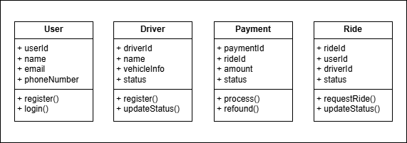

# Microservice Architecture for a Ride-Sharing Platform

## Introduction
This repository showcases a microservice-based architecture for a ride-sharing application inspired by popular platforms like Uber and Lyft. The aim is to demonstrate how cloud-native solutions can support a scalable, modular, and real-time ride-sharing service. This demo covers key features such as user registration, driver management, ride handling, and payment processing.

## Key Features
- User registration and profile management.
- Driver onboarding, status updates, and real-time availability.
- Ride requests, updates, and management with live status tracking.
- Payment processing for completed rides,  including  refound.

## 1. Object Modeling
To create a microservice architecture for a ride-sharing platform, we need to model key resources and their interactions:

### Key Resources
- **User**: Represents passengers who use the platform.
- **Driver**: Represents individuals who offer rides.
- **Ride**: Represents the actual ride requests and statuses.
- **Payments**: Represents transactions related to completed rides.


### Class Diagram


## 2. URIs for resources
The following URI patterns standardize interactions with each resource:

### User
- **`GET /api/v1/users/{userId}`**: Retrieve user details.
- **`POST /api/v1/users`**: Register a new user.
- **`PUT /api/v1/users/{userId}`**: Update user information.

### Driver
- **`GET /api/v1/drivers/{driverId}`**: Retrieve driver details.    
- **`POST /api/v1/drivers`**: Register a new driver.
- **`PUT /api/v1/drivers/{driverId}/status`**: Update driver status (e.g., active or inactive).

### Rides
- **`POST /api/v1/rides`**: Request a new ride.
- **`GET /api/v1/rides/{rideId}`**: Retrieve ride details.
- **`PUT /api/v1/rides/{rideId}/status`**: Update ride status (e.g., accepted, completed).

### Payments
- **`POST /api/v1/payments`**: Process a new payment.
- **`GET /api/v1/payments/{paymentId}`**: Retrieve payment details.
- **`PUT /api/v1/payments/{paymentId}/status`**: Update payment status.

## 3. Resource Representation
Each resource will be represented using JSON for simplicity and standardization:

**User JSON reprentation**
```json
{
  "userId": "12345",
  "name": "John Doe",
  "email": "john.doe@example.com",
  "phoneNumber": "+1234567890"
}
```

**Ride JSON Representation:**
```json
{
  "rideId": "67890",
  "userId": "12345",
  "driverId": "54321",
  "status": "in-progress",
  "pickupLocation": "123 Main St",
  "dropoffLocation": "456 Elm St"
}
```
## 4. HTTP Method Assignments
- **GET**: Retrieve existing resource details (e.g., user or ride information).
- **POST**: Create new resources (e.g., request a ride, register a driver).
- **PUT**: Update existing resources (e.g., change ride status, update driver status).

## 5. Microservice Architecture Design
 

